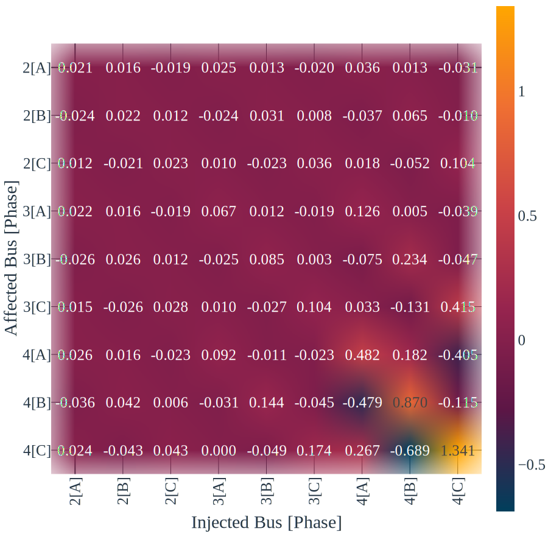

<div align="center">
    
    
    Data repository for journal paper "Three-Phase Jacobian-Based Voltage Sensitivity 
    Method for Hosting Capacity Analysis", submitted for IEEE Transactions on Sustainable Energy.
</div>

<br><br>

# ⛅ Introduction

This repository gathers the data used to develop the simulations and the results obtained, set out in the article _"Three-Phase Jacobian-Based Voltage Sensitivity Method for Hosting Capacity Analysis"_, submitted to the IEEE Transactions on Sustainable Energy.

This material aims to enable other researchers on the subject to use the model adopted for comparing and validating results and developing new research on the subject.

<br><br>

# 🗂️ Repository organization 

## Folder: _Results_
This folder contains the data from the distribution system model used for the simulations.

Please, consider the adopted bus IDs, that relates with the IEEE 37-node reference as it follows:

(Adopted Id/IEEEID): 1/701, 2/702, 3/703, 4/704, 5/705, 6/706, 7/707, 8/708, 9/709, 10/710, 11/711, 12/712, 13/713, 14/714, 15/718, 16/720, 17/722, 18/724, 19/725, 20/727, 21/728, 22/729, 23/730, 24/731, 25/732, 26/733, 27/734, 28/735, 29/736, 30/737, 31/738, 32/740, 33/741, 34/742, 35/744, 36/775, 37/799
        
### - Subfolder: _Computational Cost_
This subfolder contains the execution time for voltage estimation considering the proposed TJSM method and traditional power flow analysis, for the IEEE 4-node and 37-node feeder, for 1000 executions.

- `execution_time_4Bus.csv`: Execution time for the IEEE 4-node feeder; 
- `execution_time_37Bus.csv`: Execution time for the IEEE 37-node feeder;

The first column of the files is related to the execution time for the classical power flow simulation, and the second is related to the proposed TJSM method.

### - Subfolder: _Sensitivity Matrix_

This subfolder contains the voltage sensitivity matrix for the IEEE 4-node and 37-node feeder, considering all the load models analyzed in the paper.

- `(active/reactive)_sensitivity_(4/37)Bus_Zconst.csv`: Voltage sensitivity matrix due to active/reactive power injection for the IEEE 4/37-node feeder, considering loads as constant impedance model; 
- `(active/reactive)_sensitivity_(4/37)Bus_Iconst.csv`: Voltage sensitivity matrix due to active/reactive power injection for the IEEE 4/37-node feeder, considering loads as constant current model; 
- `(active/reactive)_sensitivity_(4/37)Bus_Pconst.csv`: Voltage sensitivity matrix due to active/reactive power injection for the IEEE 4/37-node feeder, considering loads as constant power model; 

### - Subfolder: _Voltage Estimation Error_

This subfolder contains the voltage estimation results for the IEEE 37-node feeder. Each file represents the data used to draw each of the paper's graphs.

For Figures 4, 5, 6 and 7, considering penetration scenarios Low (0), Medium (1) and High (2) and the phases numbering A (0), B (1) and C (2):

- `Fig_4_5.csv`: Data used to plot both Figures 4 and 5, related to the estimation error considering three penetration levels and unity power factor.
- `Fig_6_7.csv`: Data used to plot both Figures 6 and 7, related to the estimation error considering three penetration levels and power factor equals to 0.8. 

For Figure 8, considering the load models IDs 0 (Constant Impedance), 1 (Constant Current) and 2 (Constant Power):

- `Fig_8.csv`: Data used to plot Figure 8, related to the estimation error due to different load models.

For Figure 9, considering 0 if a voltage violation is not identified by both power flow and sensitivity methods, and 1 if identified.

- `Fig_9.csv`: Data used to plot Figure 9 relate to the estimation of the percentage of buses that different penetration levels lead to voltage violations.

For Figure 10:

- `Fig_10.csv`: Data used to plot Figure 10 relate to the estimation MAE for all combinations of double power injection in high sensitivity buses, for the IEEE 37 bus system.

### - Subfolder: _Maximum Allowable Injection Estimation_

This subfolder contains the Maximum Allowable Injection estimation results for the IEEE 37-node feeder. Each file represents the data used to draw each of the paper's graphs.

<br><br>

# 💾 Download
Download the data from this repository in `.zip` format [using this link](https://github.com/CristhianGRO/TJSM_IEEE_Sustainable_Energy/archive/refs/heads/main.zip)


<br><br>

# ✉️ Contact

Questions or suggestions? Get in touch with us:

- **E-mail:** cristhian_oliveira@usp.br | cristhiangro@gmail.com

<br><br>

# 💬 Cite this repository

```bibtex
@misc{Cristhian_TJSM_2025,
    title    = {Three-Phase Jacobian-Based Voltage Sensitivity Method for Hosting Capacity Analysis, submitted for IEEE Transactions on Sustainable Energy - Repository.},
    year     = {2025},
    url      = {https://github.com/CristhianGRO/TJSM_IEEE_Sustainable_Energy},
    author   = {Cristhian Gabriel da R. de Oliveira, Wandry R. Faria, Benvindo R. Pereira Jr. and João B. A. London Junior},
    keywords = {Distributed Generation, Photovoltaic Systems, Voltage Sensitivity Analysis, Unbalanced Networks.},
}
```
